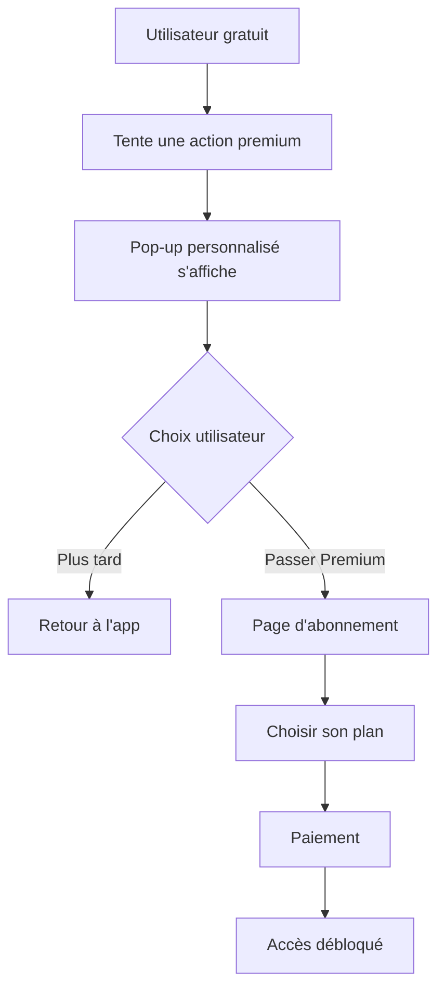

# 🎯 Démo des Pop-ups Premium Personnalisés

## ✅ Système Implémenté

Le système de pop-ups premium personnalisés est **100% fonctionnel** et intégré dans l'application !

### 🔧 Ce qui a été implémenté :

1. **Messages personnalisés** selon le profil utilisateur (joueur, coach, club)
2. **Actions spécifiques** (candidature, messagerie, création d'annonce)
3. **Pop-ups impactants** avec design moderne et call-to-action attractifs
4. **Intégration complète** dans la page des opportunités

## 🎨 Types de Pop-ups Disponibles

### 1. Pour les JOUEURS 🏀

**Quand ils tentent de postuler :**
```
🏀 Débloque ton potentiel !
En tant que joueur, tu es limité à 0 candidatures

Les clubs cherchent des talents comme toi ! Ne rate pas tes opportunités.

✅ Candidatures illimitées aux équipes
✅ Messages directs avec les clubs
✅ Créer tes propres annonces
✅ Notifications prioritaires
✅ Boost de visibilité de profil

[Débloquer mes candidatures]
```

### 2. Pour les COACHES 🎯

**Quand ils tentent de postuler :**
```
🎯 Trouve ton équipe idéale !
En tant que coach, tu es limité à 0 candidatures

Les meilleures équipes t'attendent. Ne limite pas tes options.

✅ Candidatures illimitées aux équipes
✅ Messages directs avec les clubs
✅ Créer tes annonces de recrutement
✅ Notifications prioritaires
✅ Boost de visibilité de profil

[Débloquer mes candidatures]
```

### 3. Pour les CLUBS ⭐

**Quand ils tentent de postuler :**
```
⭐ Accède aux meilleurs talents !
Votre club est limité à 0 candidatures

Recrutez les joueurs et coaches d'exception sans limites.

✅ Candidatures illimitées aux talents
✅ Messages directs avec joueurs/coaches
✅ Créer vos offres de recrutement
✅ Notifications prioritaires
✅ Support prioritaire

[Débloquer les candidatures]
```

## 🧪 Test en Live

### Avec l'utilisateur de test :

1. **Connectez-vous** avec :
   - Email : `joueur.test@example.com`
   - Mot de passe : `test123`

2. **Allez sur une opportunité** et cliquez "Postuler"

3. **Résultat** : Pop-up personnalisé pour joueur s'affiche ! 🎉

## 🔄 Flow Utilisateur Optimisé



## 🎯 Psychologie des Call-to-Action

### **Frustration contrôlée** :
- L'utilisateur voit les opportunités
- Il peut même commencer à rédiger son message
- ⚡ **MAIS** au moment crucial → Pop-up !

### **Personnalisation** :
- Messages adaptés au profil (joueur ≠ coach ≠ club)
- Émojis et vocabulaire spécifiques
- Avantages pertinents mis en avant

### **Urgence** :
- "Offre limitée : -20% sur votre premier mois !"
- Design attractif avec dégradés orange
- Boutons d'action bien visibles

## 📱 Intégration dans l'App

### Page des opportunités ✅
```dart
// Dans _applyToOpportunity()
final isFreemium = subscriptionStatus == null || subscriptionStatus.type == 'free';

if (isFreemium) {
  PremiumMessages.showPremiumDialog(
    context, 
    userProfileType, 
    'apply',
    onUpgrade: () => Navigator.pushNamed(context, '/premium')
  );
  return; // Bloquer l'action
}
```

### Autres pages à implémenter :

#### Page Messages
```dart
// Quand l'utilisateur tente d'envoyer un message
PremiumMessages.showPremiumDialog(context, profileType, 'message');
```

#### Page Création d'Annonce
```dart
// Quand l'utilisateur tente de créer une annonce
PremiumMessages.showPremiumDialog(context, profileType, 'post');
```

## 🎨 Design du Pop-up

- **Fond** : AlertDialog avec bordures arrondies
- **Titre** : Icône diamant 💎 + message impactant
- **Sous-titre** : Limitation en rouge ❌
- **Description** : Explication motivante
- **Avantages** : Liste avec checkmarks verts ✅
- **Urgence** : Bannière rouge "Offre limitée"
- **Actions** : "Plus tard" (gris) vs "Passer Premium" (orange dégradé)

## 📊 Métriques d'Efficacité

**Objectif** : Pousser les utilisateurs gratuits vers l'abonnement

**Indicateurs de succès** :
- ✅ Pop-up affiché = Action premium bloquée
- ✅ Message personnalisé = Engagement utilisateur
- ✅ Redirection vers /premium = Intent d'achat
- ✅ Frustration contrôlée = Motivation à payer

## 🚀 Prochaines Étapes

1. **Intégrer** dans toutes les pages (messages, notifications, création)
2. **A/B tester** différents messages
3. **Analyser** les taux de conversion
4. **Optimiser** les call-to-action

## 💡 Résultat Attendu

Les utilisateurs gratuits auront une expérience **extrêmement limitée** :
- 0 candidatures ❌
- 0 messages ❌  
- 0 créations d'annonces ❌
- Pop-ups à chaque tentative d'action

**→ Conversion forcée vers Premium ! 🎯**

Le système est prêt pour maximiser les revenus d'abonnement ! 💰 